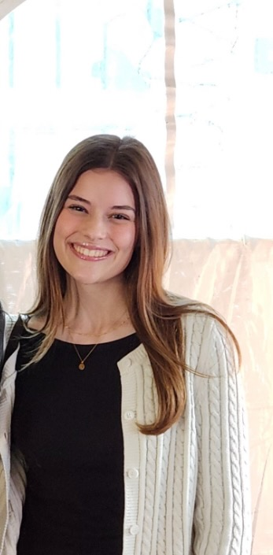

<!-- HOME: replace the name, introduction, and email below. Keep the ::: layout lines. -->
<!-- PREVIEW: first use Build > Render Website to generate every page, then Render this file. -->
:::: {.home-hero}
::: {.hero-copy}
[STUDENT / RESEARCHER / EXPLORER]{.eyebrow}

# Juliana Santucci {.display-name}

[Making sense of the social world.]{.hero-subtitle}

I am an LMU undergraduate student majoring in political science with a focus on applied data analysis. I'm originally from Oakland, CA and I aspire to attend law school after graduating from Loyola Marymount University. 

[Explore my research](research.qmd){.primary-link} [Say hello](mailto:jsantucc@lion.lmu.edu){.quiet-link}
:::

::: {.hero-photo}
<!-- Replace images/profile.jpg with your photo. Update the description in fig-alt too. -->
{fig-alt="Photo of Juliana"}
:::
::::

:::: {.home-notes}
::: {.home-note}
[01 / IN THE CLASSROOM]{.eyebrow}

## Research Focus

 I am interested in learning more about the issue of gun control and the rise of gun violence in the United States.  

:::

::: {.home-note}
[02 / BEYOND THE CLASSROOM]{.eyebrow}

## Observations

I continue to explore this topic as I travel to new places and write about my experiences. 

:::
::::
