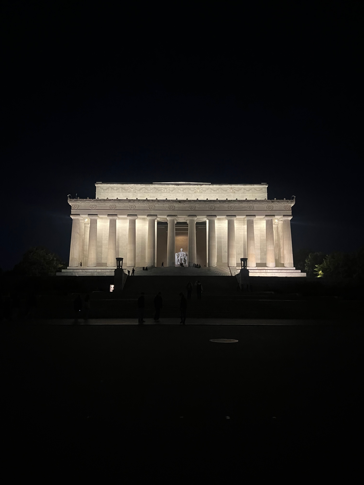

<!-- TRAVEL: replace the image, location, and short reflection with your own. -->

{.travel-photo fig-alt="Lincoln Memorial"}

## Lincoln Memorial

[NOTES / OBSERVATIONS]{.project-label}

- Traveling to the other side of the country expands your perspective on American      politics. Visiting the Lincoln memorial at night and witnessing its sheer enormity reminds me of the foundational democratic ideals of the U.S. government.

## What I want to remember

- The immense scale of the monument serves as a physical reminder to zoom out and look at the broader picture of America's democracy, especially given the current climate of political polarization. 

<!-- Add another place by copying the image and heading pattern above. -->

